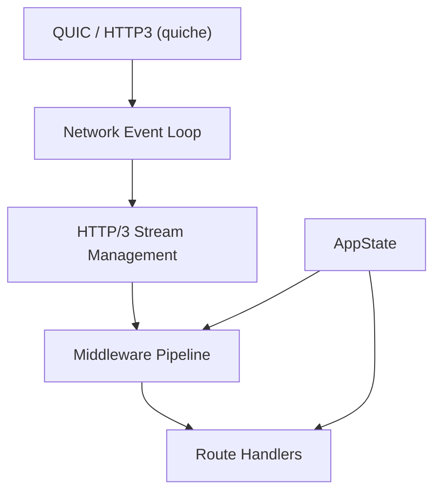
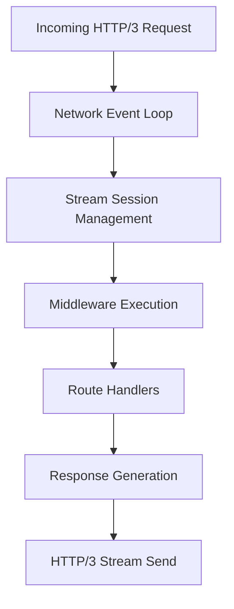

# FacesHttp3Server

Experimental HTTP/3 server framework written in Rust on top of the **QUIC implementation provided by quiche**.

The goal of this crate is to provide a lightweight abstraction layer over QUIC and HTTP/3 in order to simplify the implementation of networking applications while keeping control over the underlying transport behavior.

⚠️ This project was developed as part of an exploratory learning process and is **not intended for production use**.

---
  
# Project Context

`FacesHttp3Server` was developed in the context of a broader experimental application project exploring distributed multimedia systems and modern networking architectures.

The server framework was progressively designed while building the backend of this application. This allowed the framework to evolve through real usage scenarios and to be continuously tested by the application itself.

This approach allowed architectural decisions to emerge from concrete needs encountered during development.

---

# Main Features

- HTTP/3 server built on top of **QUIC (quiche)**
- event-driven network architecture
- modular routing system
- middleware processing pipeline
- configurable request body management
- channel-based communication between subsystems
- application state injection via a generic `AppState`

The framework focuses on **separating networking infrastructure from application logic**.

---

# Architecture Overview


This layered structure allows the networking layer to remain independent from domain-specific application logic.

# Request Lifecycle

A request handled by the server follows the processing pipeline below.



---

# Application State Model

The framework does not impose any persistence model or domain structure.

Instead, application-specific logic is injected through a user-defined `AppState` type when creating the router. This allows developers to integrate their own storage systems or application logic without modifying the server infrastructure.

Example:

```rust
#[derive(Clone)]
pub struct AppState {
    pub database: DatabasePool,
}

let router = RouteManager::new_with_app_state(AppState { database });
```

The state instance is then accessible inside middleware and route handlers:

```rust
router.handler(&|event, app_state, previous_response| {
    // access application state or storage
});
```
This design allows the framework to remain independent from the application domain while enabling flexible integration with different persistence strategies.

# Quick Start
## Create the router with application state

```rust
#[derive(Clone)]
pub struct AppStateTest;

let mut router = RouteManager::new_with_app_state(AppStateTest);
```

## Instantiate the server
Attach the router and the configuration paths.
```rust
let _server = Http3Server::new(addr)
    .add_key_path("./key.pem")
    .add_cert_path("./cert.pem")
    .set_file_storage_path("~/.temp_server/")
    .run_blocking(router);
```
## Middleware

Middlewares allow inspection or modification of request headers before the request is processed by handlers.

``` rust
let middle_ware_0 = router.middleware(&|headers, app_state| {
    MiddleWareFlow::Continue(headers)
});


```
## Route Handlers

Handlers process completed requests.

Example:

```rust
let handler_0 = router.handler(&|event, app_state, current_status_response| {
    Response::ok_200_with_data(event, vec![9; 23])
});
```

Handlers receive:

- an Event describing the completed request
- the shared application state
- the response returned by the previous handler

Multiple handlers can be chained on a route. The response returned by the last handler is sent to the client.

## Route Definition

Example of a POST route:

``` rust
router.route_post(
    "/large_data",
    RouteConfig::new(DataManagement::Storage(BodyStorage::File)),
    |route_builder| {
        route_builder.middleware(&middle_ware_0);
        route_builder.handler(&handler_0);
    },
);
```
RouteConfig allows configuration of how request bodies are handled:

`BodyStorage::InMemory`

`BodyStorage::File`

# Learning Goals

This project explores several aspects of modern systems programming:

- QUIC and HTTP/3 protocols
- event-driven server architectures
- concurrent request processing
- modular software design
- Rust systems programming


The implementation served as a practical environment for experimenting with these topics while progressively refining the architecture.

# Licence
MIT
